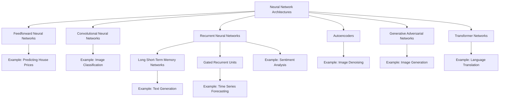
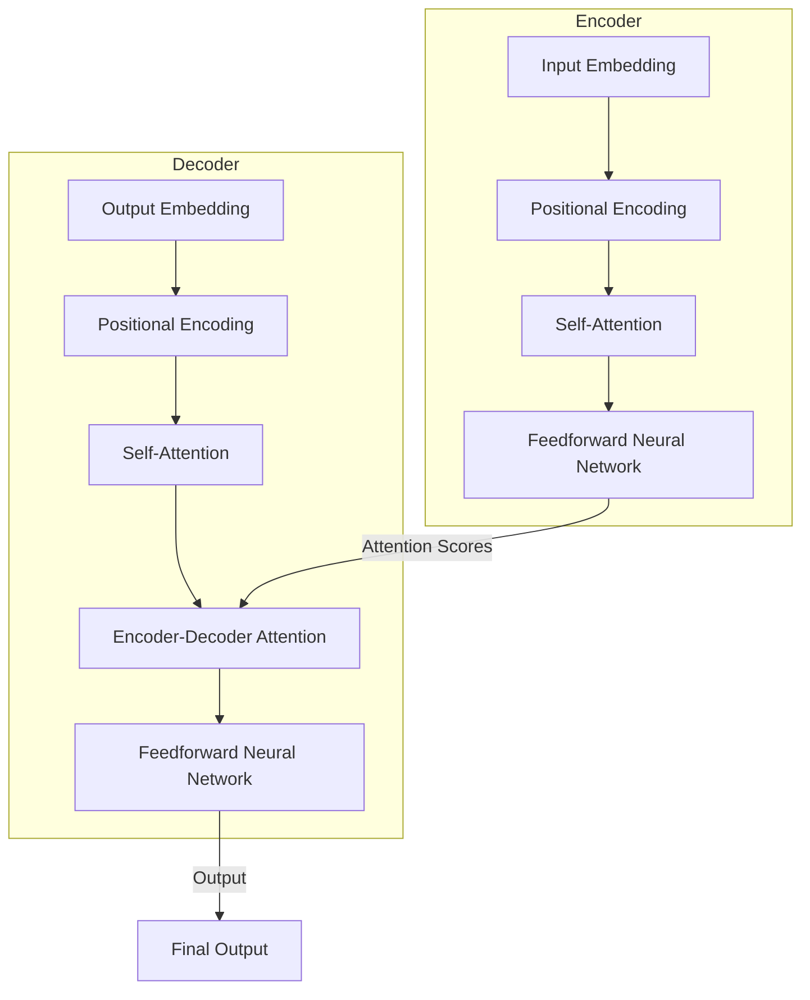

# ai-learnings

### Different Types of Neural Network Architectures

Neural network architectures vary in structure and functionality, catering to different types of tasks and data. Here are some of the main types of neural networks:

1. **Feedforward Neural Networks (FNN)**
2. **Convolutional Neural Networks (CNN)**
3. **Recurrent Neural Networks (RNN)**
4. **Long Short-Term Memory Networks (LSTM)**
5. **Gated Recurrent Units (GRU)**
6. **Autoencoders**
7. **Generative Adversarial Networks (GAN)**
8. **Transformer Networks**

### Flow Diagram of Neural Network Architectures

### Detailed Explanation of Each Architecture

1. **Feedforward Neural Networks (FNN)**
   - **Structure**: Consists of an input layer, one or more hidden layers, and an output layer. Each neuron in one layer is connected to every neuron in the next layer.
   - **Example**: Predicting house prices based on features like size, location, and number of bedrooms.
   - **Core Details**: 
     - No loops or cycles.
     - Suitable for structured data prediction tasks.

2. **Convolutional Neural Networks (CNN)**
   - **Structure**: Composed of convolutional layers, pooling layers, and fully connected layers. Convolutional layers apply filters to input data to detect features.
   - **Example**: Image classification, such as recognizing objects in pictures.
   - **Core Details**: 
     - Spatial hierarchies are captured.
     - Excellent for image and video processing tasks.

3. **Recurrent Neural Networks (RNN)**
   - **Structure**: Contains loops that allow information to be passed from one step of the network to the next, making them suitable for sequential data.
   - **Example**: Sentiment analysis of text.
   - **Core Details**: 
     - Handles sequences and temporal data.
     - Can suffer from vanishing gradient problems.

4. **Long Short-Term Memory Networks (LSTM)**
   - **Structure**: A type of RNN designed to remember information for long periods. Contains memory cells that maintain information over time.
   - **Example**: Text generation.
   - **Core Details**: 
     - Addresses the vanishing gradient problem.
     - Good for long-term dependencies.

5. **Gated Recurrent Units (GRU)**
   - **Structure**: Similar to LSTM but with a simpler architecture and fewer parameters. Combines hidden state and cell state into a single state.
   - **Example**: Time series forecasting.
   - **Core Details**: 
     - More efficient than LSTMs.
     - Suitable for similar tasks as LSTMs.

6. **Autoencoders**
   - **Structure**: Consists of an encoder that compresses the input into a latent-space representation and a decoder that reconstructs the input from this representation.
   - **Example**: Image denoising.
   - **Core Details**: 
     - Used for unsupervised learning.
     - Effective for dimensionality reduction and anomaly detection.

7. **Generative Adversarial Networks (GAN)**
   - **Structure**: Comprises two networks, a generator and a discriminator, that compete with each other. The generator creates data, and the discriminator evaluates it.
   - **Example**: Image generation.
   - **Core Details**: 
     - Generates new data that is similar to the training data.
     - Used in creative applications and data augmentation.

8. **Transformer Networks**
   - **Structure**: Uses self-attention mechanisms to weigh the importance of different parts of the input data. Consists of encoder and decoder stacks.
   - **Example**: Language translation.
   - **Core Details**: 
     - Captures long-range dependencies without sequential processing.
     - State-of-the-art for NLP tasks.
    

** Traditional RNNs/LSTMs: Imagine you’re reading a book one word at a time and trying to understand the context based on what you’ve read so far. This sequential processing can be slow and may forget long-term dependencies.
** Transformers: Now, imagine you can see the entire page at once and highlight the important parts. This is how transformers work, using self-attention to focus on relevant words regardless of their position in the text.

# Comparative Analysis of Neural Network Architectures

| **Architecture**                  | **Description**                                                                                                           | **Real-World Example**                                     | **Advantages**                                                             | **Limitations**                                                           |
|-----------------------------------|---------------------------------------------------------------------------------------------------------------------------|-------------------------------------------------------------|--------------------------------------------------------------------------|----------------------------------------------------------------------------|
| **Feedforward Neural Networks (FNN)** | Consists of input, hidden, and output layers where connections do not form cycles.                                        | Predicting house prices based on features like size and location. | Simple to implement and understand.                                       | Not suitable for sequential data or tasks requiring context memory.       |
| **Convolutional Neural Networks (CNN)** | Uses convolutional layers to detect patterns in data, particularly effective for image and video processing.             | Image classification in medical imaging to detect tumors.    | Excels in image and video data tasks; captures spatial hierarchies.       | Requires a large amount of labeled data; computationally intensive.       |
| **Recurrent Neural Networks (RNN)** | Designed to recognize sequences and temporal patterns, with loops to pass information to the next step.                  | Sentiment analysis in social media monitoring.               | Handles sequential data; captures temporal dependencies.                  | Suffers from vanishing gradient problem; struggles with long-term dependencies. |
| **Long Short-Term Memory Networks (LSTM)** | A type of RNN with special units that can remember information for long periods.                                          | Text generation for predictive text input.                   | Solves vanishing gradient problem; good for long-term dependencies.       | More complex and computationally expensive than standard RNNs.            |
| **Gated Recurrent Units (GRU)**    | Similar to LSTM but with a simpler structure and fewer parameters.                                                        | Time series forecasting for stock prices.                    | More efficient than LSTMs; good for similar tasks requiring sequence memory. | Slightly less powerful than LSTMs in some long-term dependency tasks.     |
| **Autoencoders**                   | Neural networks used to learn efficient codings of unlabeled data (dimensionality reduction, anomaly detection).          | Image denoising in photo editing software.                   | Good for unsupervised learning tasks; reduces data dimensionality.        | Can be prone to overfitting; not suitable for supervised learning tasks.  |
| **Generative Adversarial Networks (GAN)** | Consists of a generator and a discriminator network competing with each other to generate new, synthetic data samples.   | Generating realistic images for video game characters.       | Produces high-quality synthetic data; useful for creative applications.   | Training can be unstable; requires careful tuning of hyperparameters.     |
| **Transformer Networks**           | Uses self-attention mechanisms to process sequential data without relying on its order, excelling in NLP tasks.            | Language translation in Google Translate.                    | Handles long-range dependencies; highly parallelizable and efficient.     | Requires a large amount of data; computationally intensive training process. |
